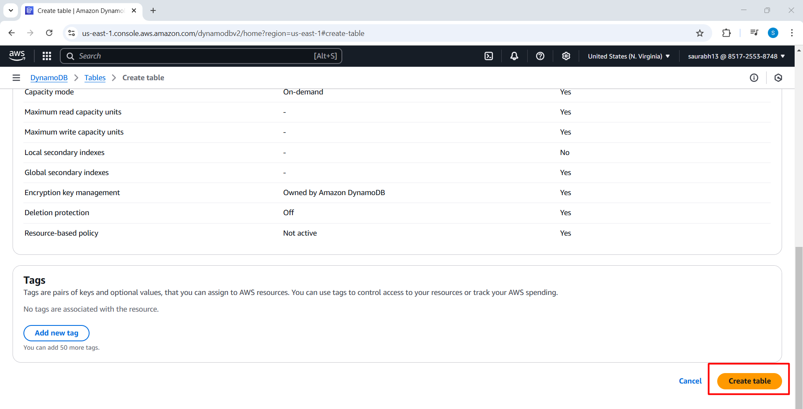
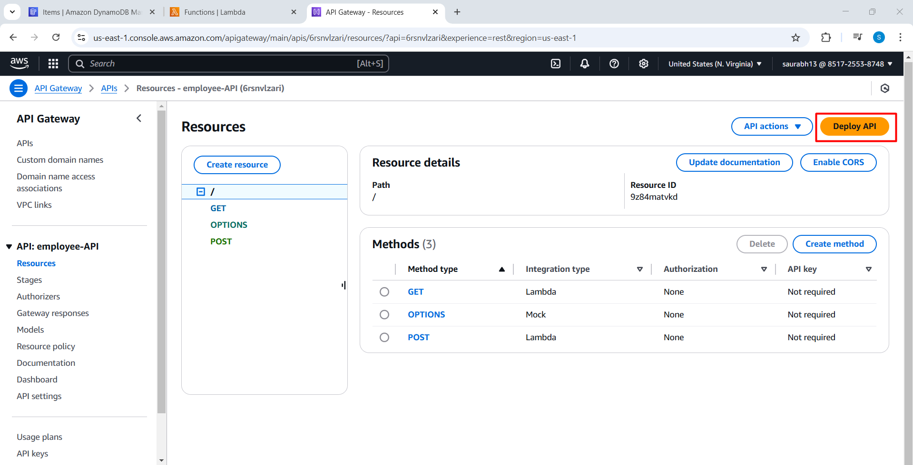
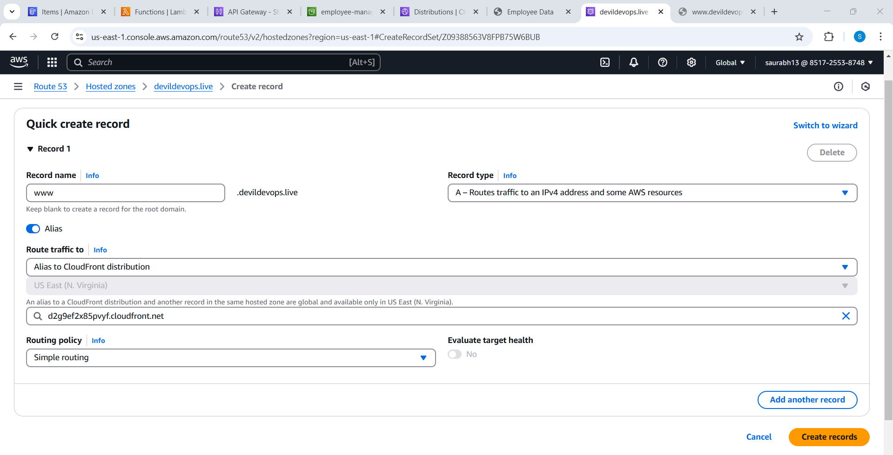

# AWS Serverless Architecture with CloudFront, S3, API Gateway, Lambda, and DynamoDB


## Project Overview
This project demonstrates a fully serverless architecture on AWS to deploy a web application. It leverages:
- **DynamoDB** for data storage
- **Lambda** functions for handling GET and POST operations
- **API Gateway** for exposing APIs
- **S3** for hosting static files (HTML, JavaScript)
- **CloudFront** for content delivery
- **Route 53** for domain name mapping (optional)

## Architecture Flow
1. User interacts with the frontend hosted on **S3 and CloudFront**.
2. API requests are routed through **API Gateway**.
3. API Gateway triggers **Lambda functions** to insert or retrieve data from **DynamoDB**.
4. Data is stored/retrieved and returned to the frontend.

---

## Deployment Steps

### Step 1 - Create DynamoDB Table
1. Navigate to AWS DynamoDB and create a new table:
   - **Table Name**: `employeeData`
   - **Partition Key**: `employeeid` (String)





### Step 2 - Create Lambda Functions
Two Lambda functions will handle inserting and fetching employee data.

#### 1. `insertEmployeeData` Lambda Function
- Create a new Lambda function with the name `insertEmployeeData`.
- Set the **Runtime** to **Python**.


- Attach an existing **execution role** or create a new one with DynamoDB permissions.


- Add the code from the repository (`insertEmployeeData.py`).


- Deploy the function.
- Create a test event and verify that data is inserted into DynamoDB.


#### 2. `GetEmployee` Lambda Function
- Create another Lambda function named `GetEmployee`.
- Set the **Runtime** to **Python**.


- Attach an execution role with the necessary permissions.


- Add the code from the repository (`GetEmployee.py`).


- Deploy the function.
- Create a test event and verify that it returns a **200 status code**.


### Step 3 - Create API Gateway
1. Navigate to **API Gateway** and create a **REST API** named `employee-api`.


2. Create an **HTTP POST method** and link it to the `insertEmployeeData` Lambda function.


3. Create an **HTTP GET method** and link it to the `GetEmployee` Lambda function.


4. Enable **CORS** for **GET, POST, and OPTIONS** methods.


5. Deploy the API and create a **Prod stage**.



6. Copy the generated **API endpoint URL** and update it in `script.js`.


### Step 4 - Create an S3 Bucket
1. Navigate to **S3** and create a new bucket.
2. Upload the **`index.html`** and **`script.js`** files to the bucket.


### Step 5 - Create a CloudFront Distribution
1. Select **S3 bucket domain name** as the **origin domain**.
2. Create a new **Origin Access Control (OAC)**.


3. Set **Default Root Object** to `index.html`.


4. Update the **bucket policy** to allow CloudFront access.


5. Once the CloudFront distribution is deployed, access your website using the CloudFront **distribution URL**.


6. Verify the **POST and GET requests** to API Gateway.


### Step 6 - (Optional) Create a Route 53 Record
1. Navigate to **Route 53** and create an **A record** with alias pointing to **CloudFront Distribution**.



2. Access the website using your custom domain (`devildevops.live`).


3. Note: It may take a few hours for CloudFront to propagate changes to your domain.

---

## Conclusion
This project demonstrates a scalable **serverless** architecture on AWS using **CloudFront, S3, API Gateway, Lambda, and DynamoDB**. It provides a cost-effective and high-availability solution for hosting dynamic applications without managing infrastructure.

Feel free to contribute or raise issues in this repository!

---

## Repository Structure
```
/ (Project Root)
├── index.html         # Frontend HTML file
├── script.js          # JavaScript file for API calls
├── insertEmployeeData.py  # Lambda function for inserting data
├── GetEmployee.py         # Lambda function for fetching data
└── README.md          # Project documentation
```

### License
This project is open-source under the **MIT License**.

